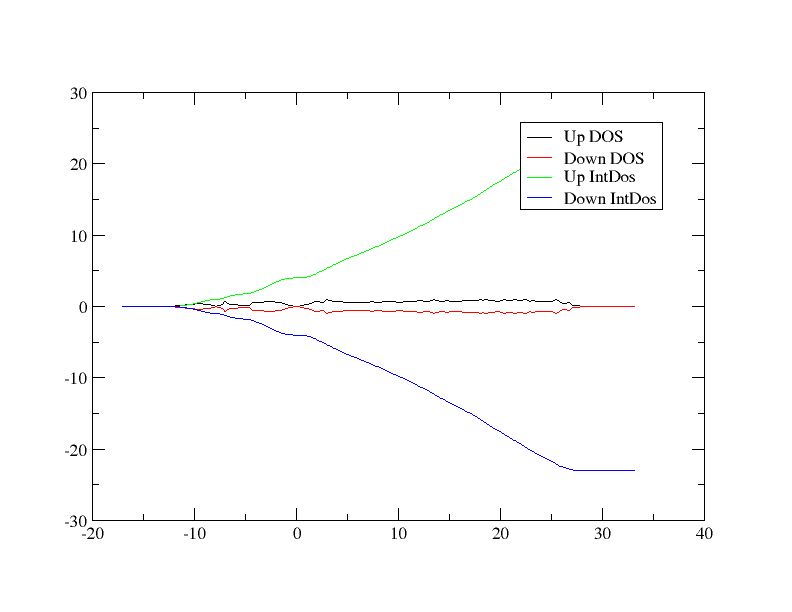
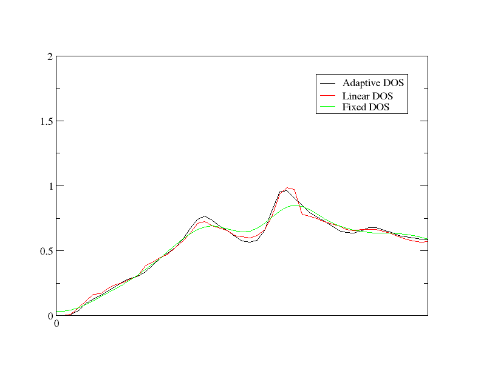

# Density od States

In this tutorial, we will go through a simple example of using Optados to calculate the electronic density of states (DoS) of crystalline silicon in a 2 atom cell. We will then examine how Optados' adaptive broadening can be used to resolve fine spectral features that a fixed broadening scheme will obscure.

## ODO Output

Firstly, we will run the calculation and examine the Optados output file `Si.odo`. We will use the `cell` file

*Si.cell*
```
%BLOCK LATTICE_CART
2.73  2.73 0.00
2.73  0.00 2.73
0.00  2.73 2.73
%ENDBLOCK  LATTICE_CART

%BLOCK POSITIONS_FRAC
Si 0.0     0.0     0.0
Si 0.25    0.25    0.25
%ENDBLOCK POSITIONS_FRAC

SYMMETRY_GENERATE

KPOINTS_MP_GRID 10 10 10  
SPECTRAL_KPOINTS_MP_GRID 10 10 10
```

together with the `param` file

*Si.param*
```
TASK                   : SPECTRAL
SPECTRAL_TASK          : DOS
PDOS_CALCULATE_WEIGHTS : TRUE
SPIN_POLARIZED         : TRUE
CUT_OFF_ENERGY         : 200
IPRINT                 : 1
```

The first 2 lines are what determine that we will be doing a DoS calculation. Run castep as usual, and then run optados on Si with the Optados input file

*Si.odi*
```
TASK              : dos
EFERMI : optados
DOS_SPACING       : 0.1
BROADENING        : adaptive # Default
ADAPTIVE_SMEARING : 0.4      # Default
FIXED_SMEARING    : 0.3      # Default
SET_EFERMI_ZERO : true       # Default
DOS_PER_VOLUME  : false      # Default
NUMERICAL_INTDOS      : false  # Default
FINITE_BIN_CORRECTION : true  # Default
```

One interesting thing to note here is the line `efermi : optados` - this sets the internal value of the Fermi level to the one it has derived from the DoS. This is important for subsequent calculations. Other valid options are:

* `file`, where `optados` uses the value calculated by the electronic structure code that generated the eigenvalues
* `insulator`, where optados uses a value calculated from assuming the system is non-metallic
* A custom value you may want to use

This generates 3 files:

* `Si.odo` - Optados general output file.
* `Si.adaptive.dat` - The adaptive broadened DOS raw output data.
* `Si.adaptive.agr` - The adaptive broadened DOS in a file suitable to be plotted by  xmgrace.

Let's have a look at the file `Si.odo`

Towards the top of the data output, we have a table looking like this:

	```
	+--------------- Fermi Energy Analysis ---------------------------+
	| From Adaptive broadening                                        |
	| Spin Component:1 occupation between 3.99964 and    4.00003 <-Oc |
	| Spin Component:2 occupation between 3.99964 and    4.00003 <-Oc |
	|       Fermi energy (Adaptive broadening) : 4.4479 eV     <- EfA |
	+-----------------------------------------------------------------+
	```

It has used the integrated DOS to work out the Fermi level, and has suggested the error in the integration by indicating the number of electrons at the Fermi level. Since we had 4 up electrons and 4 down in the input file this analysis seems satisfactory.

Optados now performs some analysis of the DOS at the Fermi level,

```
+----------------------- DOS at Fermi Energy Analysis -----------------------+
|                          Fermi energy used :   4.4479 eV                   |
| From Adaptive broadening                                                   |
|   Spin Component : 1   DOS at Fermi Energy :   0.0010 eln/cell      <- DEA |
|   Spin Component : 2   DOS at Fermi Energy :   0.0010 eln/cell      <- DEA |
+----------------------------------------------------------------------------+
```

From this we may assume that there is a band gap.

A bit further down, Optados then calculates the band energy from the DOS is has calculated.

```
+--------------------------- Band Energy Analysis ---------------------------+
|          Band energy (Adaptive broadening) :      -6.3472 eV        <- BEA |
|                  Band energy (From CASTEP) :      -6.3471 eV        <- BEC |
+----------------------------------------------------------------------------+
```

As the quality of the optados calculation is increased these two values should converge to the same answer.

## Other Output Files

Finally, Optados shifts the Fermi level to 0 eV for the output files - let's have a look at the other 2 files generated.

The DoS is written to `Si2.adaptive.dat`. This contains 5 columns - the 1st is the energy, the 2nd is the up-spin DoS, the 3rd is the down-spin DoS, the 4th is the up-spin integrated DoS, and the 5th is the down-spin integrated DoS. If instead `SPIN_POLARIZED : FALSE` were set in the `param` file, there would only be 3 columns: energy, DoS and integrated DoS.

This file can be plotted by your preferred graph-plotting software. However, `optados` has made things easy and generated a  `Si2.adaptive.agr` file which is directly plottable using `xmgrace` - to get a plot all you have to run is:

```
$ xmgrace Si2.adaptive.agr
```

The graph should look a bit like this:

{width="40%"}

What is important to mention is that this `agr` file only contains the data for DoS, not integrated DoS. If you want to plot all the data, including up and down integrated DoS, run `xmgrace -batch other_data.bat` on the batch file

*other_data.bat*
```
READ BLOCK "Si.adaptive.dat"

BLOCK XY "1:2"
S0 LEGEND "Up DOS"

BLOCK XY "1:3"
S1 LEGEND "Down DOS"

BLOCK XY "1:4"
S2 LEGEND "Up IntDos"

BLOCK XY "1:5"
S3 LEGEND "Down IntDos"
```

This should give a graph that looks like:

{width="40%"}

## Band Gap Analysis

Let's go back to looking at the `odo` output file. Because `COMPUTE_BAND_GAP : TRUE` is set by default, the band gap analysis section should already be present. The results are a table that looks like:

```
+----------------------------- Bandgap Analysis -----------------------------+
|          Number of kpoints at       VBM       CBM                          |
|                   Spin :   1  :      1         1                           |
|                   Spin :   2  :      1         1                           |
|               Thermal Bandgap :   0.6724150536  eV                  <- TBg |
|            Between VBM kpoint :    0.05000    0.05000    0.05000           |
|                 and CBM kpoint:   -0.45000   -0.45000   -0.05000           |
|             ==> Indirect Gap                                               |
+----------------------------------------------------------------------------+
|                            Optical Bandgap                                 |
|                   Spin :   1  :     2.5639496096  eV                <- OBg |
|                   Spin :   2  :     2.5639441673  eV                <- OBg |
|          Number of kpoints with this gap                                   |
|                   Spin :   1  :           1                                |
|                   Spin :   2  :           1                                |
+----------------------------------------------------------------------------+
|                            Average Bandgap                                 |
|                   Spin :   1  :     3.8132681742  eV                <- ABg |
|                   Spin :   2  :     3.8132658290  eV                <- ABg |
|              Weighted Average :     3.8132670016  eV                <- wAB |
+----------------------------------------------------------------------------+
```

Optados is very careful in its band gap analysis. It uses the bare eigenvalues (un-broadened) and works out the nature and size of the thermal gap, optical gap and the average gap over all of the Brillouin zone. In cases of multi-valleyed semiconductors optados will report the number of conduction band minima or valence band maxima with identical energies, but will not report the nature of the gap.


## Broadening

We will now compare the different forms of broadening. This can be done quickly by changing the first in `Si.odi` to

`task : compare_dos`

and re-running Optados. This gives us 4 new output files - `Si_linear.dat` and `Si_fixed.dat`, plus their accompanying `agr` files. Let's compare them by running `xmgrace -batch compare.bat` on the batch file

*compare.bat*
```
READ BLOCK "Si.adaptive.dat"

BLOCK XY "1:2"
S0 LEGEND "Adaptive DOS"

READ BLOCK "Si.linear.dat"

BLOCK XY "1:2"
S1 LEGEND "Linear DOS"

READ BLOCK "Si.fixed.dat"
BLOCK XY "1:2"
S2 LEGEND "Fixed DOS"

WORLD XMIN 0
WORLD XMAX 5
```

!!! note
    We're looking at a small region, between 0 and 5 eV, so it is easier to see the differences

The graph should look like this:



To further improve the appearance of the graph, you can lower `DOS_SPACING` and tinker with the value of `ADAPTIVE_SMEARING` in the `odi` file.
