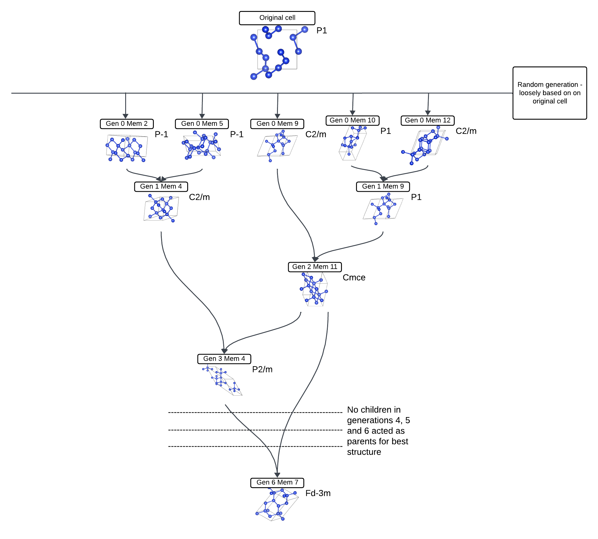

# Introduction

In this tutorial we will look at exactly what castep GA is doing when it is used, examining what the input files do what the output files tell us. We will go through a silicon example to do so - starting from a heavily distorted diamond cell and ending in a diamond structure.

In my run, the "family tree" of the final structure found looks like this:



We will have a look at how this happened.

!!! note
    Yours is unlikely to be exactly the same - castep GA is heavily based on randomness and thus each run is going to be different, likely even if using the same seed

## Input Files

We will use the `cell` file

*Si.cell*

```
%block LATTICE_ABC
ang
5.4 5.4 5.4
90  90  90
%endblock LATTICE_ABC

%block POSITIONS_FRAC
Si  0.2   0.01   0.04
Si  0.21   0.29   0.30
Si  0.59   0.43   0.03
Si  0.9   0.81   0.30
Si  0.53   0.03   0.58
Si  0.72   0.21   0.79
Si  0.04   0.45   0.4
Si  0.28   0.85   0.69
%endblock POSITIONS_FRAC

%BLOCK SPECIES_POT
QC5
%ENDBLOCK SPECIES_POT

symmetry_generate
symmetry_tol : 0.05 ang
```

Note that this is just a heavily distorted version of a ideal diamond silicon cell - `LATTICE_ABC` defines its cubic structure with the lattice parameter that is expected, while the fractional positions of all the Si's are slightly moved from where they'd be expected for diamond - for example the first line

`Si 0.2 0.01 0.04`

is only a bit off from where it'd be in a perfect diamond, which is

`Si 0 0 0`

In a normal castep GA run the positions of all the Si's, and even the starting unit cell, is completely arbitrary, and in most cases it should have little impact on the run. However, in this case we are trying to get it to get to diamond quickly, so that it is easier to analyse what is going on.
