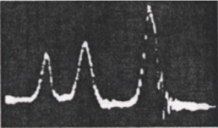
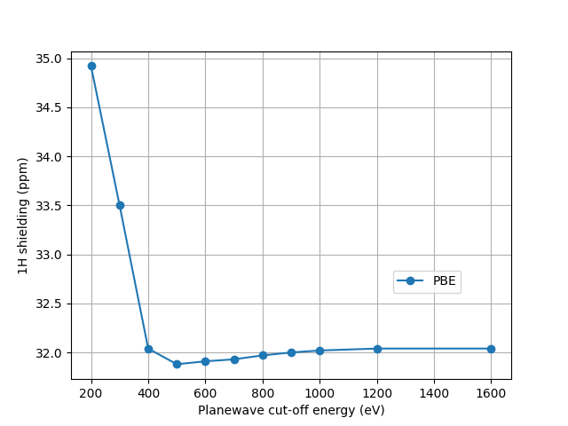

{width="50%"}
<figure style="display: inline-block;">
  <figcaption style="text-align: left;">Fig1. Proton spectrum of ethanol</figcaption>
</figure>


The discovery that one could actually see chemical shifts in hydrogen spectra was made in 1951 at Stanford University by Packard, Arnold, Dharmatti (shown in Fig1.). We will try to reproduce this result.  


## Files   


*ethanol.cell*
```

%BLOCK LATTICE_ABC
6 6 6
90 90 90
%ENDBLOCK LATTICE_ABC

%BLOCK POSITIONS_ABS
H 3.980599 4.178342 3.295079
H 5.033394 3.43043 4.504759
H 5.71907 4.552257 3.315353
H 3.720235 5.329505 5.509909
H 4.412171 6.433572 4.317001
H 5.911611 5.032284 6.242202
C 4.84694 4.350631 3.941136
C 4.603025 5.518738 4.882532
O 5.746254 5.812705 5.6871
%ENDBLOCK POSITIONS_ABS

%BLOCK KPOINTS_LIST
0.25 0.25 0.25 1.0
%ENDBLOCK KPOINTS_LIST
```

*ethanol.param*
```
xcfunctional = PBE
fix_occupancy = true
opt_strate.g.y : speed
task        = magres

cut_off_energy  = 20 ry
```


## Objectives:

1. Examine the convergence of the chemical shieldings with planewave cutoff.
2. Compare to experiment.

## Instructions:

1. Look at the [cell](../../documentation/Input_Files/cell_file.md) and [param](../../documentation/Input_Files/param_file.md) files. Note that the only special keyword is `task = magres`

 2. Run castep
  `castepsub -n 4  ethanol`
   Look at the ***ethanol.castep*** output file. At the end, the isotropic chemical shielding, anisotropy, and asymmetry are reported.
 The result should contain these lines:
 ```
 ====================================================================
 |                      Chemical Shielding Tensor                   |
 |------------------------------------------------------------------|
 |     Nucleus                            Shielding tensor          |
 |  Species            Ion            Iso(ppm)   Aniso(ppm)  Asym   |
 |    H                1               29.45       8.84      0.14   |
 |    H                2               30.10       8.07      0.20   |
 |    H                3               29.94       7.12      0.06   |
 |    H                4               26.83       8.02      0.95   |
 |    H                5               27.24      -7.07      0.90   |
 |    H                6               31.93      13.99      0.46   |
 |    C                1              157.27      33.77      0.70   |
 |    C                2              110.73      69.91      0.42   |
 |    O                1              268.63     -50.78      0.96   |
 ====================================================================
 ```
 Here we are only interested in the isotropic values


3. This information, plus the full tensors, are also given in the file ethanol.magres

4. You might wish to transfer the ***ethanol.magres*** file back to your desktop to visualise with [MagresView](https://www.ccpnc.ac.uk/magresview/magresview/magres_view.html?JS).

5. Identify which (hydrogen) ion corresponds to which part of the molecule - in the case of ethanol, find out which ones correspond to CH3~3~ CH~2~ and OH.
This can be done by uploading the cell file to VESTA and clicking each atom. <br>{width="40%"} <br>Here you can see that one of the CH~3~ hydrogens is atom 3

6. Examine the effect
 of increasing the cutoff energy (say 20-50 Ryd in steps of 10 Ryd). It always helps to plot a graph of the convergence (e.g. with gnuplot or xmgrace on the cluster - or with excel on the PC). The result looks a bit like this:
 {width="75%"} <br>
 Find the "converged" hydrogen (or proton in NMR language) shieldings. We will compare them to experiment. The three methyl (CH~3~) protons undergo fast exchange; they "rotate" faster than the nuclear magnetic moment processes. The magnetic moment will therefore "see" an average chemical shielding. The same is true of the CH~2~ protons.

7. Average the CH~3~ and CH~2~ chemical shieldings. This will give you 3 unique chemical shieldings (including the OH reading).

8. We now need to convert the chemical shieldings $\sigma_{iso}$; to chemical shifts $\delta_{iso}$ on the experimental scale. We use the relation:  $\delta_{iso}$=$\sigma_{iso}$ - $\sigma$.
A suitable $\sigma_{ref}$ for ^1^H is 30.97ppm.


{width="40%"}

<figure Fig2 style="display: inline-block;">
  <figcaption style="text-align: left;">Fig2. <sup><small>1</small></sup>H NMR spectrum of liquid ethanol</figcaption>
</figure>
 Fig2. shows a modern high-resolution ^1^H spectrum for liquid ethanol. Note that the peaks are split due to J-coupling - the interaction of the ^1^H magnetic moments - but let's ignore that for now. The three peaks are roughly at 1.2ppm, 3.7ppm and 5ppm. You should find that your computed values agree for two sites. Do you know why the other site has such a large disagreement with experiment?
