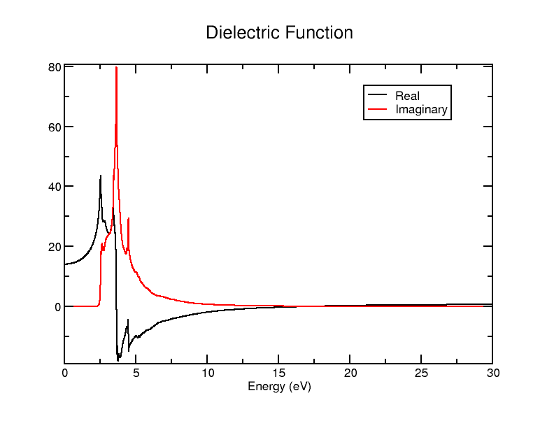

### Optics

In this tutorial, we will use Optados to examine the optical properties of silicon and aluminium.

## Silicon

For Silicon, we will use the input `cell` file

*Si.cell*
```
%BLOCK LATTICE_CART
2.73  2.73 0.00
2.73  0.00 2.73
0.00  2.73 2.73
%ENDBLOCK  LATTICE_CART

%BLOCK POSITIONS_FRAC
Si 0.0     0.0     0.0
Si 0.25    0.25    0.25
%ENDBLOCK POSITIONS_FRAC

SYMMETRY_GENERATE

KPOINTS_MP_GRID 10 10 10  
SPECTRAL_KPOINTS_MP_GRID 14 14 14
```

and the `param` file

*Si.param*
```
TASK                   : SPECTRAL
SPECTRAL_TASK          : OPTICS
CUT_OFF_ENERGY         : 200
IPRINT                 : 2

```
Run Castep as usual. When it is done, run Optados on Si with the Optados input file

*Si.odi*
```
# Choose the task to perform
TASK               : optics

# Sample the JDOS at 0.01 eV intervals
JDOS_SPACING       : 0.01

# Calculate the JDOS up to 60eV about the valence band maximum
JDOS_MAX_ENERGY    : 30

# Recalculate the Fermi energy using the new DOS
# (discasrd the CASTEP efermi)
EFERMI             : optados

# Since we're recalculating the Fermi energy we do
# a DOS calculation first.
# Sample the DOS at 0.1 eV intervals
DOS_SPACING        : 0.1

# The broadening used, (also try linear, or fixed)
BROADENING         : adaptive # Default

# The broadening parameter, A, when using adaptive smearing,
# set by eye to be similar to the linear smearing method
ADAPTIVE_SMEARING  : 0.4     # Default

# Specify the geometry to be used in the optics calculation
OPTICS_GEOM        : polycrystalline     # Default

# Include additional broadening for the loss function
OPTICS_LOSSFN_BROADENING : 0.0    # Default

```

After running Optados, we get several output `.dat` and `.agr` files. We will now examine them.

### Epsilon.dat

First let's look at the file containing the (polycrystalline) dielectric function - `Si_epsilon.dat`. The contents of the file look like

```
0.0000000000000000        14.107263205387552        0.0000000000000000     
1.0003334444814937E-002   14.107363765236455        0.0000000000000000     
2.0006668889629875E-002   14.107665455817445        0.0000000000000000     
3.0010003334444812E-002   14.108168310237140        0.0000000000000000    
```

The 1st column corresponds to the energy (of the photon interacting with it), the 2nd is the real component of the dielectric function, and the 3rd is the imaginary component.

The header also contains the results of the sum rule $\int_0^{\omega'} \textrm{Im} \epsilon(\omega) \mathrm{d}\omega = N_\textrm{eff}(\omega')$

`# Result of sum rule: Neff(E) =     7.0939380864459736`

Where $N_\textrm{eff}$ is the effective number of electrons contributing to the absorption process, and is a function of energy.

Let's plot it using xmgrace. Although you could plot the `dat` file (after configuring a bit to get it to plot everything properly), but luckily Optados has also generated an equivalent `agr` file that contains the same data, but also formats the xmgrace graph better. So let's use

`xmgrace Si_epsilon.agr`

and get an output looking like

{width="60%"}


* `Si2_OPTICS_absorption.dat` : This file contains the absorption coefficient (second column) as function of energy (first column).
* `Si2_OPTICS_conductivity.dat` : This file contains the conductivity outputted in SI units (Siemens per metre).  The columns are the energy, real part  and imaginary part of the conductivity respectively.  

* `Si2_OPTICS_loss_fn.dat` : This file contains the loss function (second column) as a function of energy (first column).  The header of the file shows the results of the two sum rules associated with the loss function $\int_0^{\omega'} \textrm{Im} -\frac{1}{\epsilon(\omega)}\omega \mathrm{d}\omega = N_\textrm{eff}$ and $\int_0^{\omega'} \textrm{Im} -\frac{1}{\epsilon(\omega)}\frac{1}{\omega} \mathrm{d}\omega = \frac{\pi}{2}$
* `Si2_OPTICS_reflection.dat` : This file contains the reflection coefficient (second column) as a function of energy (first column).
* `Si2_OPTICS_refractive_index.dat` : This file contains the refractive index.  The columns are the energy and real and imaginary parts of the refractive index respectively. Corresponding `.agr` files are also generated which can be plotted easily using xmgrace.

* Change parameters `JDOS_SPACING` and `JDOS_MAX` and check the effect on the optical properties.  Note: all of the other optical properties are derived from the dielectric function.  
*  The `optados` input file has been set up to calculate the optical properties in the polycrystalline geometry (`optics_geom = polycrystalline`).  It is possible to calculate either polarised or unpolarised geometries, or to calculate the full dielectric tensor.  To calculate the full dielectric tensor set `optics_geom = tensor`.  This time only the file `Si2_OPTICS_epsilon.dat` is generated.  The format of this file is the same as before (the columns are the energy and the real and imaginary parts of the dielectric function respectively), but this time the six different components of the tensor are listed sequentially in the order $\epsilon_{xx}$, $\epsilon_{yy}$, $\epsilon_{zz}$, $\epsilon_{xy}$, $\epsilon_{xz}$ and $\epsilon_{yz}$.

* Additional broadening can be included in the calculation of the loss function.  This is done by including the keyword `optics_lossfn_broadening` in the optados input file.  If you include this keyword and re-run optados, you will find that the file `Si2_OPTICS_loss_fn.dat` now has three columns.  These are the energy, unbroadened spectrum and broadened spectrum respectively.  

#### Aluminium

* Aluminium is a metal so we need to include both the interband and intraband contributions to the dielectric function.  To include the intraband contribution `optics_intraband = true` must be included in the `optados` input file.  When you run optados, the same files are generated as when only the interband term is included.  

* The `Al_OPTICS_epsilon.dat` file has the same format as before, but it now contains sequentially the interband contribution, the intraband contribution and the total dielectric function.  The file `Al_OPTICS_epsilon.agr` only contains the interband term.  In the same way, `Al_OPTICS_loss_fn.dat` contains the interband contribution, intraband contribution and total loss function.  All other optical properties are calculated from the total dielectric function and the format of the output files remains the same.

* In the case where the dielectric tensor is calculated and the intraband term is included, only the `Al_OPTICS_epsilon.dat` file is generated.  As before it contains each component, but this time it lists sequentially the interband contribution, intraband contribution and total dielectric function for each component.   

* This time, if additional broadening for the loss function is included by using the key word `optics_lossfn_broadening`,  `AL_OPTICS_loss_fn.dat` will contains four sequential data sets.  These are the interband contribution, the intraband contribution, the total loss function without the additional broadening and the broadened total loss function.  
