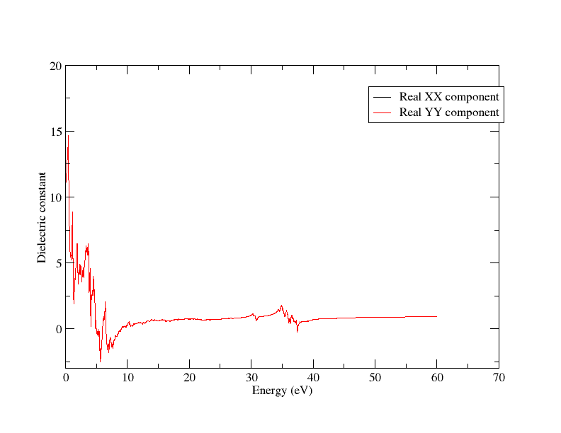

# Optics

Optados is capable of getting numerous optical properties of different structures, all of which depend on the wavelength (energy) of light interacting with it. In this tutorial, we will perform an Optados optics calculation on rutile (TiO~2~) - a birefringent crystal with anisotropic optical properties, examining its single-crystal and polycrystalline (isotropic) properties.

We will use the cell file

*rut.cell*

```
%BLOCK LATTICE_ABC
  4.6257000   4.6257000   2.9806000
 90.0000000  90.0000000  90.0000000
%ENDBLOCK LATTICE_ABC
%BLOCK POSITIONS_FRAC

Ti      0.0000000   0.0000000   0.0000000
O       0.2821000   0.2821000   0.0000000

%ENDBLOCK POSITIONS_FRAC

SYMMETRY_GENERATE

KPOINTS_MP_GRID 10 10 10
SPECTRAL_KPOINTS_MP_GRID 14 14 14
```

This `cell` file was obtained using cif2cell using the structure with the COD ID 1010942, found on the [Crystallography Open Database](www.crystallography.net)

We will first run a castep calculation using the above cell with the `param` file

*rut.param*

```
TASK                   : SPECTRAL
SPECTRAL_TASK          : OPTICS
CUT_OFF_ENERGY         : 200
```

Once that is done, we can perform the optical Optados calculations.

## Dielectric Tensor

We will begin by examining the dielectric tensor. We will do this by using the Opdatos input file

*rut.odi*

```
TASK               : optics

# Sample the JDOS at 0.01 eV intervals
JDOS_SPACING       : 0.01

# Calculate the JDOS up to 60eV about the valence band maximum
JDOS_MAX_ENERGY    : 60

# Recalculate the Fermi energy using the new DOS
# (discasrd the CASTEP efermi)
EFERMI             : optados

# Since we're recalculating the Fermi energy we do
# a DOS calculation first.
# Sample the DOS at 0.1 eV intervals
DOS_SPACING        : 0.1

# The broadening used, (also try linear, or fixed)
BROADENING         : adaptive # Default

# The broadening parameter, A, when using adaptive smearing,
# set by eye to be similar to the linear smearing method
ADAPTIVE_SMEARING  : 0.4     # Default

# Specify the geometry to be used in the optics calculation
OPTICS_GEOM        : tensor     # Default
# Include additional broadening for the loss function
OPTICS_LOSSFN_BROADENING : 0.0    # Default
```

The line `TASK : optics` is key here, as that is what tells us to perform an optical calculation. The other crucial line is `OPTICS_GEOM : tensor` - this tells it to calculate the full dielectric tensor of rutile. This produces 2 output files: `rut.odo` and `rut_epsilon.dat` - we are interested in the latter.

The output file starts off looking like

```
# Component            1


  0.0000000000000000        10.985963719914423        0.0000000000000000     
  1.0001666944490749E-002   10.986133776534746        4.5560614006426980E-003
  2.0003333888981498E-002   10.990669467897412        5.9329124271557589E-003
```
The 1st column corresponds to energy (in eV), the 2nd is the real part of the dielectric constant and the 3rd is the imaginary part. The file contains 6 components, each having their own table. This is bothersome to plot, so let's use a Python script to separate it into its components

*separate.py*

```python

input_file = 'rut_epsilon.dat'
print ("huh")
def write_to_file(component,lines):
  file_name = "rut_tens" + str(component) + ".dat"
  with open(file_name,"w") as f:
    f.writelines(lines)

with open("rut_tens.dat", "r") as f:
  lines = f.readlines()[::-1]
component_lines = []
component = 6
for line in lines:

  component_lines.append(line)
  if "Componen" in line:

    write_to_file(component,component_lines)
    component -= 1
    component_lines = []
```

!!! note
    It is recommended to copy and do this is in a separate directory - we will be comparing this output to subsequent calculations. In future instructions this will be in the directory "tensors"

We now have 6 files for each component of the 3x3 tensor (keep in mind that it is symmetric ie. $\epsilon_{xy}$ = $\epsilon_{yx}$). `rut_tens1.dat` corresponds to  $\epsilon_{xx}$, 2 and 3 and to yy and zz, while 4, 5 and 6 correspond to xy, xz and yz.

Now that we have all the components, let's start actually looking at the results. First, let's plot the real parts of $\epsilon_{xx}$ and $\epsilon_{yy}$ on the same graph. We can do this by using the batch file

*plot_12_together.bat*
```
READ BLOCK "rut_tens1.dat"

BLOCK xy "1:2"
S0 LEGEND "Real XX component"

READ BLOCK "rut_tens2.dat"

BLOCK xy "1:2"
S1 LEGEND "Real YY component"

XAXIS LABEL "Energy (eV)"
YAXIS LABEL "Dielectric constant"

```

and plotting it with xmgrace via

`xmgrace -batch plot_12_together.bat`

This gives us a graph looking like this:



There is only 1 line visible - they (almost) perfectly overlap, meaning that $\epsilon_{xx}$ = $\epsilon_{yy}$. Now let's try comparing $\epsilon_{xx}$ with $\epsilon_{zz}$ - all you have to do is make the 2nd block `rut_tens3.dat` (and change the legend appropriately).


This is a rather interesting result: this seems that the dielectric function in different directions is different - the material is optically anisotropic. Since it is identical in 2 directions, it would be considered birefringent. 
